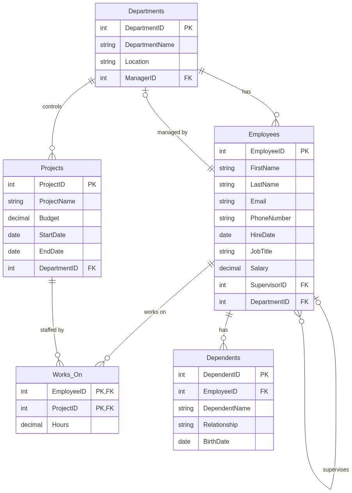

# MySQL Database Practice

This repository contains SQL scripts and exercises for practicing database management, specifically using MySQL.

## Company Database Schema

The core of this project is a robust **Company Database** schema (`company_schema.sql`), designed to simulate a real-world organizational structure. It includes employees, departments, projects, and their relationships.

### Entity Relationship Diagram (ERD)



## Tables Overview

-   **Employees**: Stores comprehensive employee data, including salary and hierarchical supervisor links.
-   **Departments**: Organizational units, each managed by a specific employee.
-   **Projects**: Initiatives controlled by departments, with defined budgets and timelines.
-   **Works_On**: Tracks the hours each employee contributes to specific projects (Many-to-Many relationship).
-   **Dependents**: Family members associated with employees for benefits/records.

## Getting Started

### Prerequisites

-   MySQL Server installed.
-   A MySQL client (command line or GUI like MySQL Workbench, DBeaver).

### Usage

1.  **Clone the repository**:
    ```bash
    git clone https://github.com/wasim-builds/MySQL-DataBase.git
    cd MySQL-DataBase
    ```

2.  **Import the Schema and Data**:
    ```bash
    mysql -u root -p < mysql/company_schema.sql
    ```

3.  **Run Verification (Optional)**:
    To confirm the data was loaded and relationships are working:
    ```bash
    mysql -u root -p < mysql/verification.sql
    ```

4.  **Practice Queries**:
    Explore the `mysql/` directory for various problem-solving scripts (e.g., `question_01_basic_select.sql`). Note that some older question files might use simplified ad-hoc schemas; refer to `company_schema.sql` for the master structure.
